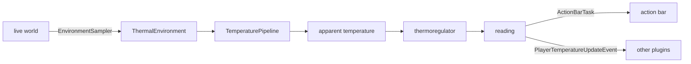

# TemperaturePlugin

A physics-based temperature simulation for **Paper 26.2**. Players feel heat and cold from where they
are standing: the biome's climate, how high they are, the season, the sun, the rain, whether they are
in water, what is burning or frozen nearby, and what they are wearing. A player's body temperature
drifts towards what the air feels like rather than snapping to it, and crossing a threshold sets them
alight or freezes them.

The whole heat-transfer model is derived and documented in [`docs/physics_model.md`](docs/physics_model.md).
Day-to-day operation is in [`docs/usage.md`](docs/usage.md).

---

## What is inside

The build is a two-module Maven project. The split is not decoration — it is what makes the physics
testable without a server.

| Module | Contents | Depends on |
|---|---|---|
| `temperature-core` | The model: units, climate bands, the vertical lapse, the humidity curve, the emitter field, the apparent-temperature regressions and the body integrator. **No Bukkit type anywhere.** | nothing |
| `temperature-plugin` | The Paper 26.2 adapter: configuration, environment sampling, scheduling, commands, persistence, the event API. The only module that touches Bukkit. | `paper-api`, `temperature-core` |



`ThermalEnvironment` is the seam: the adapter measures the world once, the physics never asks the
server a question.

## Design notes

* **Strategy pipeline.** Each term — biome, season, emitters, armour, effects, immersion — is a
  `TemperatureModifier`. Additive contributions are summed before multiplicative factors are applied,
  so the result is independent of registration order.
* **Immutable inputs, immutable settings.** `ThermalEnvironment`, `TemperatureSettings` and
  `AmbientState` are records or frozen objects. A tick's computation cannot be perturbed by a later
  mutation, and a reload is one atomic swap rather than a scatter of mutated fields.
* **Exact integration.** The body relaxes with the closed-form exponential step, not an Euler
  increment, so the result does not depend on how finely time is chopped.
* **Gated regressions.** The heat index and wind chill are used only inside the ranges they were fitted
  for, with the dry-bulb temperature as the honest fallback.

## Building

```bash
mvn clean package        # produces temperature-plugin/target/TemperaturePlugin-3.0.0.jar
mvn test                 # 122 tests, no server required
```

Requires JDK 25+ and Maven 3.9+. Paper 26.2 runs on Java 25; the modules compile with
`--release 25`, so a newer-only API fails the build rather than at runtime.

## Corrections inherited from 1.x

The recode fixes a set of real defects in the original plugin, all of them enumerated with reasoning in
§15 of the physics document. The most significant:

* a `System.exit(0)` **time bomb** that terminated any server running the plugin after 1 March 2025;
* the heat index evaluated outside its fitted domain, reporting negative "felt" temperatures in the
  cold and ≈ 90 °C in the heat;
* humidity divided by ten before entering a percentage-expecting regression, muting it entirely;
* a solar bonus applied to every player regardless of shelter, because the sky test compared a block to
  itself;
* interpolation performed in the player's display unit, so players converged at different physical
  rates;
* the effective thermal time constant silently changed with the *performance* profile.

## License

No license is granted by this repository. See the repository owner before redistributing.
